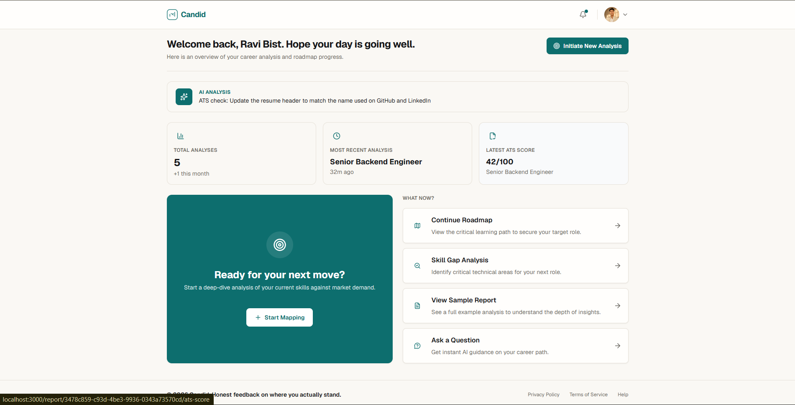
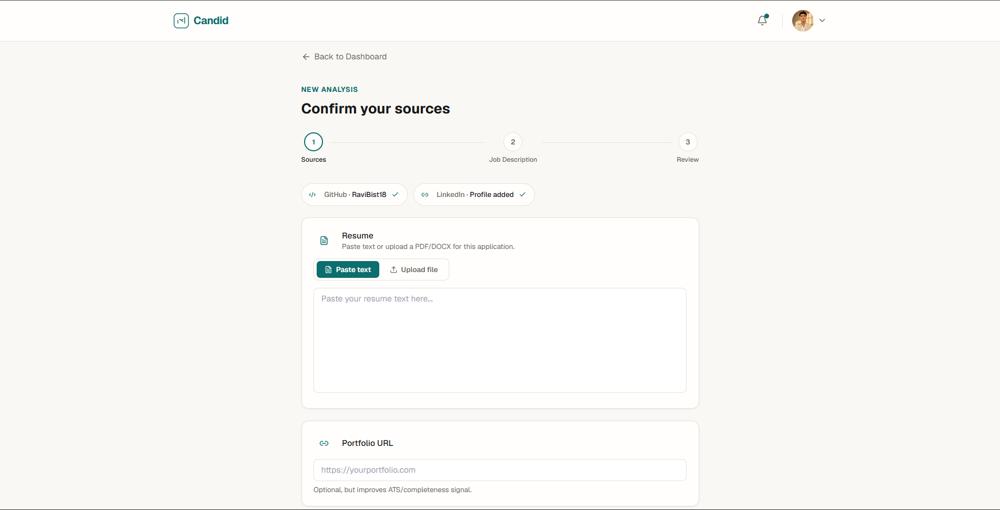
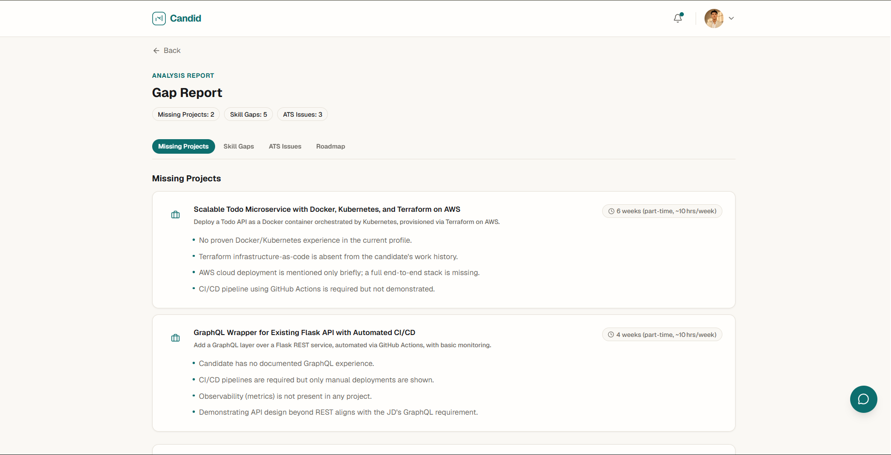
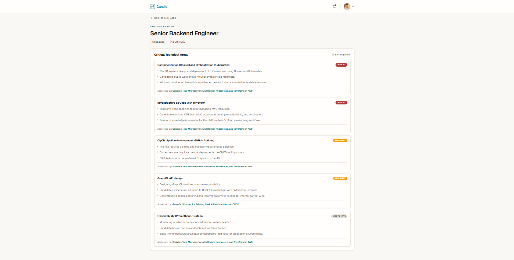
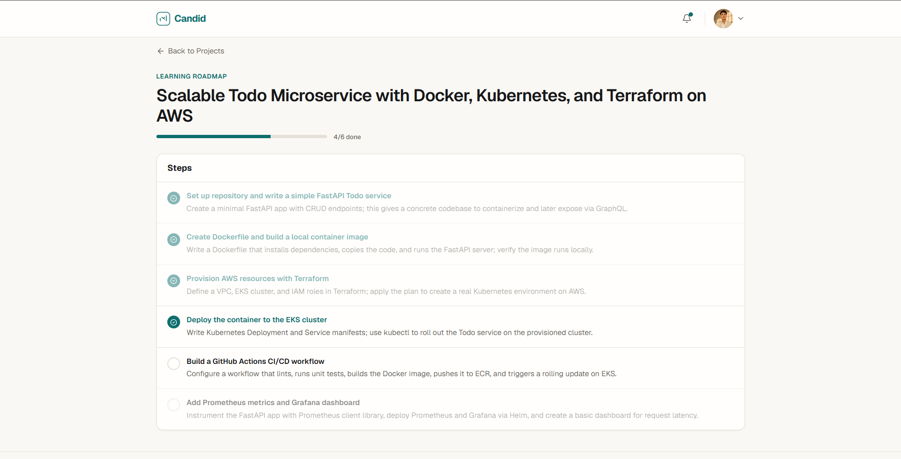
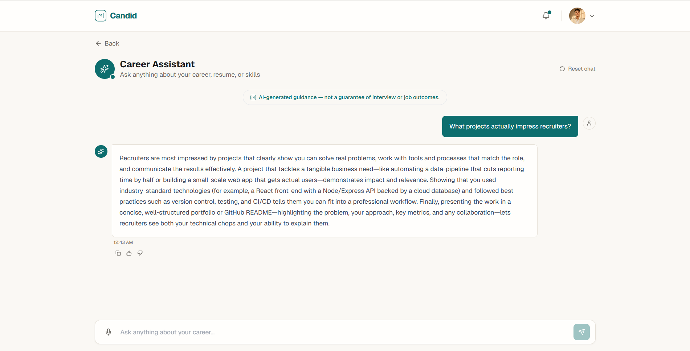

<div align="center">


 # Candid
 
**Honest Feedback on Where You Actually Stand**

Know exactly what's missing from your profile — before a recruiter or ATS filter tells you, too late.

[](https://candid-three-zeta.vercel.app/)
[](https://render.com/)
[](https://groq.com/)

[](https://nextjs.org/)
[](https://www.typescriptlang.org/)
[](https://fastapi.tiangolo.com/)
[](https://www.python.org/)
[](https://supabase.com/)
[](https://vercel.com/)
[](LICENSE)

</div>

_______________________________________________________________________________________________________________________________________________________

## Why this exists

Most job seekers have no idea what's actually missing from their profile until an interviewer — or a silent ATS filter — quietly rejects them. Career advice stays generic. GitHub activity, resume, portfolio, and LinkedIn all sit in separate silos, and nothing ever cross-checks them against a real job description.

Recruiters and ATS systems routinely screen out candidates over:
- Missing keywords the resume never mentions
- Skill gaps nobody flagged before the interview
- Portfolio projects that don't match what the role actually needs
- Formatting an ATS parser silently mangles

...none of it visible to the candidate until it's too late.

**Candid closes that gap.** Connect your sources — GitHub, resume, portfolio, LinkedIn — paste a target job description, and get back:

- What skills you're actually missing for this role
- What projects your profile lacks that the JD implies
- What will break in an ATS parse
- A personalized weekly roadmap to close the gaps

All grounded in real job-posting and ATS-rule data retrieved via RAG — not a generic AI guess.

_______________________________________________________________________________________________________________________________________________________
## Screenshots

| Dashboard | Connect Sources |
|---|---|
|  |  |

| Analysis Report | Skill Gap Analysis |
|---|---|
|  |  |

| Roadmap | Ask a Question |
|---|---|
|  |  |

_______________________________________________________________________________________________________________________________________________________


## What it does

| Capability | Description |
|---|---|
| 🔗 **Source Connect** | GitHub OAuth, resume upload/paste, LinkedIn paste, portfolio URL |
| 🧠 **RAG-Grounded Gap Analysis** | Groq (`gpt-oss-120b`) compares your sources against a target JD, grounded in retrieved job-posting + ATS-rule chunks via pgvector — not model guesswork |
| 📋 **Report** | Skill gaps, missing projects, ATS/parser issues, weekly roadmap |
| ✅ **Interactive Roadmap** | Checklist-style roadmap items, trackable over time |
| 💬 **Follow-up Chat** | Ask questions scoped to your own report |
| 🗂️ **Dashboard/History** | Past analyses, revisit reports |
| 📋 **Report** | Skill gaps, missing projects, numeric ATS score + parser issues, weekly roadmap |

_______________________________________________________________________________________________________________________________________________________

## Results

> Numbers below are placeholders — swap with real counts before publishing.

- ✅ **500+** job-posting chunks indexed in pgvector
- ✅ **150+** ATS rule chunks indexed
- ✅ **12** REST endpoints across 8 router modules
- ✅ **~6s** average analysis time (JD → full report)
- ✅ **RAG-grounded** — every skill gap and ATS flag cites retrieved job-posting/ATS-rule data, not model memory

_______________________________________________________________________________________________________________________________________________________

## How it works
```
Connect Sources — Next.js (Vercel)
  GitHub OAuth, resume upload/paste, LinkedIn paste,
  portfolio URL. Stored via Supabase.
         ↓
Paste Target JD
  User submits the job description they're targeting,
  run against already-connected sources.
         ↓
Retrieve Grounding Context — pgvector
  JD embedded (sentence-transformers/all-MiniLM-L6-v2),
  top-k matching job_posting + ats_rule chunks pulled via
  Supabase RPC (match_corpus_chunks). This is the RAG
  retrieval step.
        ↓
Analyse — Groq gpt-oss-120b
  Sources + retrieved context compared against the JD —
  grounded in real job-posting/ATS data, not a guess.
  This is the RAG generation step.
        ↓
Generate Report — FastAPI
  Skill gaps, missing projects, ATS score, weekly roadmap
  assembled and returned as structured JSON.
        ↓
Done — Dashboard updated
  Report saved, appears in history, roadmap becomes
  trackable, follow-up chat unlocked.
```

_______________________________________________________________________________________________________________________________________________________

## Why built this way

| Area | Approach | Reasoning |
|---|---|---|
| **AI output format** | Structured JSON, not raw markdown | Early tests returned clean markdown but UI needs a fixed schema to render reliably — JSON mode locked in before building Report UI |
| **Embeddings** | HuggingFace Inference API (`sentence-transformers/all-MiniLM-L6-v2`), with retry/backoff | Free-tier, no local model hosting needed — retry logic added since cold-start model loading on HF's shared inference endpoint can time out |
| **Vector search** | pgvector on Supabase, not a separate vector DB | Corpus (job postings + ATS rules) is small and static — one fewer service to run, deploy, and pay for at this scale |
| **Retrieval scope** | Two separate chunk types (`job_posting`, `ats_rule`), queried independently | Keeps skill-gap grounding and ATS-parser grounding from bleeding into each other — cleaner citations per report section |
| **Auth** | Supabase Auth (GitHub OAuth) | Users already connect GitHub as a data source — same login covers auth, no separate identity system |
| **Repo** | Monorepo | Solo/small-scale project, <100 users target — one repo to manage beats coordinating two |
| **Scale target** | <100 users, no load testing | Matches actual expected usage — performance pass explicitly deprioritized until real growth |
| **Auth & PII handling** | Full security scrutiny, no fast-mode shortcuts | Handles GitHub OAuth tokens and resume data — security corners here have real cost |

_______________________________________________________________________________________________________________________________________________________

## Tech stack

### Frontend

| Technology | Purpose |
|---|---|
| Next.js (App Router) | React framework |
| TypeScript | Type-safe frontend code |
| Tailwind CSS | Styling |
| Supabase JS / Auth Helpers | Auth, session, and data client |
| lucide-react | Icon system |

### Backend

| Technology | Purpose |
|---|---|
| FastAPI | REST API |
| Pydantic | Request validation |
| PyJWT | Token verification |

### AI pipeline

| Technology | Purpose |
|---|---|
| Groq SDK | LLM inference (`openai/gpt-oss-120b`) |
| sentence-transformers (`all-MiniLM-L6-v2`) via HuggingFace Inference API | Embeddings for RAG |
| psycopg2 + pgvector | Vector search over Supabase Postgres |
| pdfplumber | PDF resume text extraction |
| python-docx | DOCX resume text extraction |

### Infra

| Technology | Purpose |
|---|---|
| Vercel | Frontend deployment |
| Render | Backend deployment |
| Supabase | Postgres, Auth, Storage |
| UptimeRobot | Keep-alive pings, prevents free-tier sleep |

_______________________________________________________________________________________________________________________________________________________

## Project structure

```
Candid/
├── backend/
│ ├── app/
│ │ ├── routers/
│ │ │ ├── account.py # user account CRUD
│ │ │ ├── analyses.py # trigger + fetch analyses
│ │ │ ├── assistant.py # general career Q&A
│ │ │ ├── chat.py # follow-up chat scoped to a report
│ │ │ ├── dashboard.py # dashboard stats/summary
│ │ │ ├── reports.py # report fetch, roadmap items
│ │ │ ├── skill_gaps.py # skill gap data
│ │ │ └── sources.py # GitHub/resume/LinkedIn/portfolio CRUD
│ │ ├── ai_service.py # Groq orchestration for analysis pipeline
│ │ ├── ats_scoring.py # ATS score calculation
│ │ ├── auth.py # Supabase JWT auth dependency
│ │ ├── config.py # env/settings
│ │ ├── db.py # Supabase client
│ │ ├── groq_client.py # Groq SDK wrapper
│ │ ├── main.py # FastAPI app — routers registered here
│ │ ├── models.py # Pydantic schemas
│ │ ├── rag_service.py # RAG orchestration (retrieve + generate)
│ │ └── resume_extract.py # PDF/DOCX resume text extraction
│ ├── data/ # legal/job-posting/ATS-rule source data
│ ├── migrations/ # DB schema migrations
│ ├── scripts/
│ │ ├── ingest_corpus.py # chunk job postings/ATS rules into corpus
│ │ ├── retrieval.py # embed + pgvector RPC search
│ │ └── trim_job_postings.py # corpus cleanup/preprocessing
│ ├── requirements.txt
│ └── verify_schema.py
│
└── frontend/
├── app/
│ └── (app)/
│ ├── analyses/
│ ├── analyze/
│ ├── ask/
│ ├── dashboard/
│ │ ├── DashboardClient.tsx
│ │ └── page.tsx
│ ├── help/
│ ├── privacy/
│ ├── report/[id]/
│ ├── roadmap/
│ ├── sample-report/
│ ├── settings/
│ ├── skill-gaps/
│ ├── sources/
│ └── terms/
├── auth/
├── login/
├── signup/
├── components/
├── lib/
├── middleware.ts
├── tailwind.config.ts
└── candid-roadmap.md
```

_______________________________________________________________________________________________________________________________________________________
## Environment Variables

### Backend (`backend/.env`)

```env
# Supabase
SUPABASE_URL=your_supabase_url
SUPABASE_SERVICE_KEY=your_supabase_service_key

# AI
GROQ_API_KEY=your_groq_api_key
HF_API_KEY=your_huggingface_api_key

# App
FRONTEND_URL=http://localhost:3000
```

### Frontend (`frontend/.env.local`)

```env
NEXT_PUBLIC_SUPABASE_URL=your_supabase_url
NEXT_PUBLIC_SUPABASE_ANON_KEY=your_supabase_anon_key
NEXT_PUBLIC_API_URL=http://localhost:8000
```

_______________________________________________________________________________________________________________________________________________________
## Running it locally

### Prerequisites

```
Node.js v18+
Python 3.10+
Git
A Supabase project with pgvector enabled
A Groq API key
A HuggingFace API key
```


### 1. Clone

```bash
git clone https://github.com/RaviBist18/Candid.git
cd Candid
```

### 2. Backend

```bash
cd backend
python -m venv venv && source venv/bin/activate   # Windows: venv\Scripts\activate
pip install -r requirements.txt
```

Set up `backend/.env` — see [Environment Variables](#environment-variables) above.

```bash
uvicorn app.main:app --reload
```

Runs at `http://localhost:8000`

### 3. Ingest Corpus

```bash
cd scripts
python ingest_corpus.py    # chunk job postings + ATS rules into corpus
```

### 4. Frontend

```bash
cd frontend
npm install
```

Set up `frontend/.env.local` — see [Environment Variables](#environment-variables) above.

```bash
npm run dev
```

Runs at `http://localhost:3000`

_______________________________________________________________________________________________________________________________________________________
## API Endpoints

### Auth (`/auth`)

| Method | Endpoint | Description |
|---|---|---|
| POST | `/auth/signup` | Create account |
| POST | `/auth/login` | Login, start session |

### Sources (`/sources`)

| Method | Endpoint | Description |
|---|---|---|
| GET | `/sources` | Get connected sources |
| POST | `/sources/github` | Connect GitHub (OAuth) |
| POST | `/sources/resume` | Upload/paste resume |
| POST | `/sources/linkedin` | Paste LinkedIn text |
| POST | `/sources/portfolio` | Add portfolio URL |

### Resume (`/resume`)

| Method | Endpoint | Description |
|---|---|---|
| POST | `/resume/extract` | Extract text from PDF/DOCX upload |

### Analyses (`/analyses`)

| Method | Endpoint | Description |
|---|---|---|
| POST | `/analyses` | Trigger a new analysis against a target JD |
| GET | `/analyses` | List past analyses |
| GET | `/analyses/{id}` | Get a single analysis |

### Reports (`/reports`)

| Method | Endpoint | Description |
|---|---|---|
| GET | `/reports/{id}` | Get full report |
| PATCH | `/reports/{id}/roadmap/{item_id}` | Toggle roadmap item (sequential lock) |

### Skill Gaps (`/skill-gaps`)

| Method | Endpoint | Description |
|---|---|---|
| GET | `/skill-gaps/{report_id}` | Get skill gap breakdown for a report |

### Chat (`/chat`)

| Method | Endpoint | Description |
|---|---|---|
| POST | `/chat/{report_id}` | Follow-up chat scoped to a specific report |

### Assistant (`/assistant`)

| Method | Endpoint | Description |
|---|---|---|
| POST | `/assistant/ask` | General career Q&A, not report-scoped |

### Dashboard (`/dashboard`)

| Method | Endpoint | Description |
|---|---|---|
| GET | `/dashboard` | Summary stats — total analyses, latest ATS score, etc. |

### Account (`/account`)

| Method | Endpoint | Description |
|---|---|---|
| GET | `/account` | Get profile |
| PATCH | `/account` | Update profile |

_______________________________________________________________________________________________________________________________________________________

## Current Scope

- Resume parsing supports PDF and DOCX only — scanned/image-based PDFs with no extractable text are rejected, no OCR fallback yet.
- LinkedIn ingestion is manual paste — no official API integration, since none exists for scraping-friendly access.
- Portfolio ingestion is URL-only — no content scraping, used as a completeness signal.
- Groq free-tier rate limits apply — no queueing/backoff built for high concurrent load, matches <100 user scale target.
- HuggingFace Inference API cold-starts can add latency to embedding calls — retry/backoff handles most cases, not all.

_______________________________________________________________________________________________________________________________________________________
## License

MIT — see [LICENSE](LICENSE) for details.

_______________________________________________________________________________________________________________________________________________________
## Author

**Ravi Bist**

[](https://github.com/RaviBist18)
[](https://www.linkedin.com/in/ravi-bist-vk1418)

---

<div align="center">

**Candid** — know exactly where you stand.

</div>
